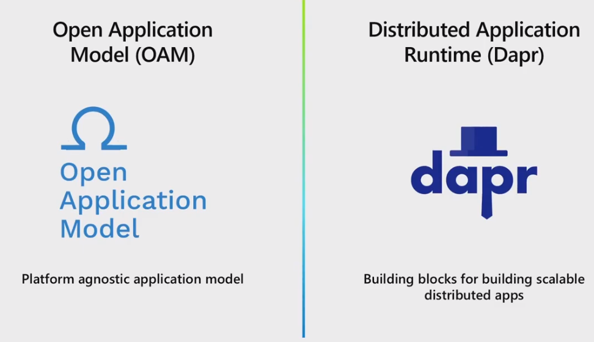

# Open Application Model Specification (https://github.com/oam-dev/spec)

# Azure Info Hub

* OAM, https://azureinfohub.azurewebsites.net/Service/Videos?serviceTitle=Open%20Application%20Model
* Dapr, https://azureinfohub.azurewebsites.net/Service/Videos?serviceTitle=Open%20Application%20Model

# OAM on Youtube

* 20200722 Webinar: Building application management platform with Open Application Model, youtu.be/fagh1_vVmVY
* 20200602 The Future of Cloud Native Applications with Open Application Model and Dapr, youtu.be/eJCu6a-x9uo
  * 
* 20200220 Webinar: OAM: A Team-Centric App Model for Application Developers and Operators | CNCF, youtu.be/ix3ew8BWl70
* 20200207 Intro to Rudr: A Kubernetes Implementation of the Open Application Model | Azure Friday, youtu.be/3xykOuZ9960
* 20200207 Learn all about Open Application Model (OAM) | Azure Friday, youtu.be/SMQQpCXCOw0
* 20191114 Dapr, Rudr, OAM | Mark Russinovich presents next gen app development & deployment (Microsoft Ignite), youtu.be/LAUDVk8PaCY